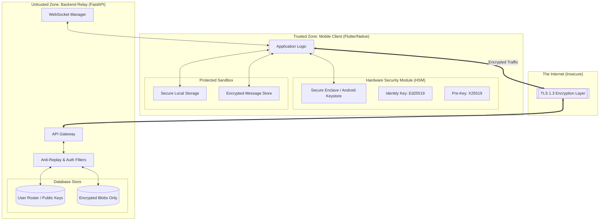
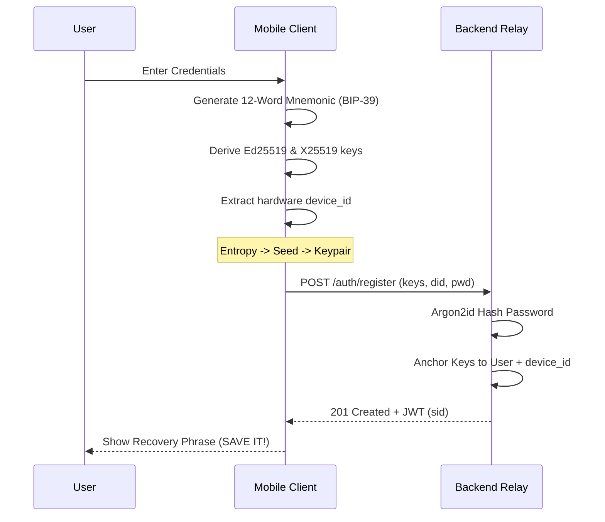
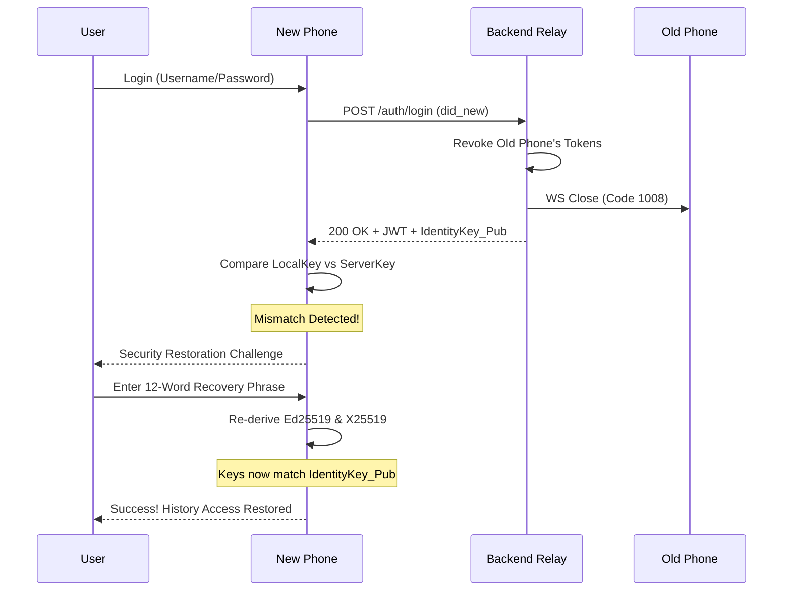
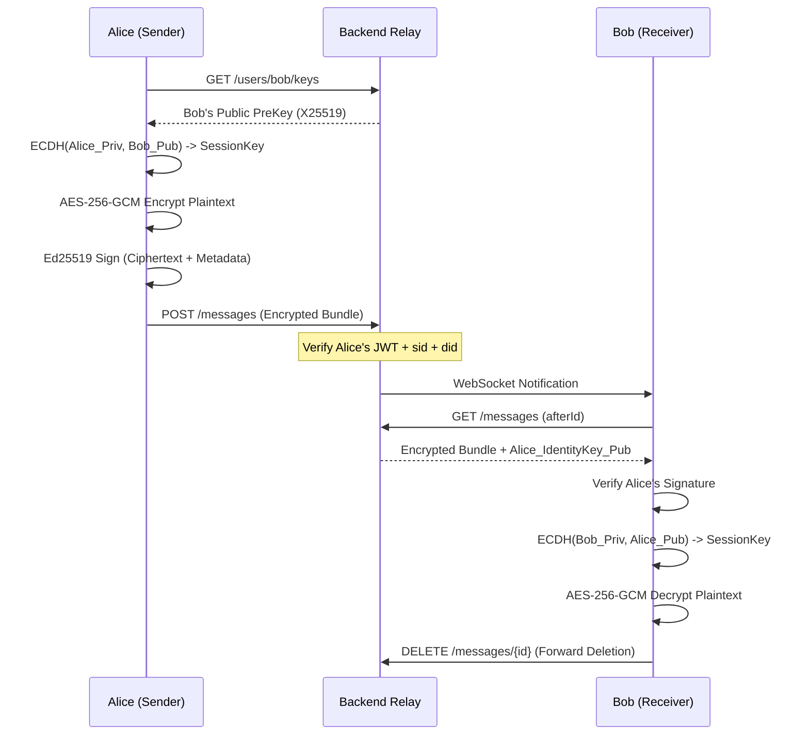

# SecureMessenger: Comprehensive Security Architecture & Implementation Reference

This document serves as the formal technical specification for the SecureMessenger platform. It details the end-to-end security pipeline, cryptographic protocols, and defensive strategies employed to maintain user privacy in a zero-knowledge environment.

---

## 1. System Architecture & Trust Boundaries

The system is architected around the principle of **Client-Side Sovereignty**. Trust is centralized within the user's physical device, while the network and relay server are treated as hostile or potentially compromised actors.

### 1.1 Architectural Component Diagram

### 1.2 Trust Boundaries Defined
- **TCB (Trusted Computing Base)**: Includes the application code, the Pure Dart cryptographic engine, and the OS-level storage for secrets (`flutter_secure_storage`).
- **Cryptographic Barrier**: Plaintext never crosses from the Trusted Zone to the Internet. Only Base64-encoded, authenticated ciphertext is permitted to leave the device.
- **Relay Role**: The relay is purely a "dumb" router. It performs authentication (is the user who they say they are?) but cannot perform decryption (what is the user saying?).

---

## 2. Threat Model

### 2.1 Assets & Security Goals
| Asset | Confidentiality | Integrity | Authenticity |
|---|:---:|:---:|:---:|
| Message Plaintext | HIGH | HIGH | HIGH |
| Sender Identity | MEDIUM | HIGH | HIGH |
| Public Keys | LOW | HIGH | HIGH |
| Session Tokens | MEDIUM | HIGH | HIGH |

### 2.2 Adversaries & Capabilities
1. **The Network Eavesdropper**: Can capture every packet. **Mitigation**: AES-256-GCM + X25519.
2. **The Malicious Admin**: Has root access to the Backend server and Database. **Mitigation**: Zero-knowledge storage (no access to private keys or plaintext).
3. **The Identity Spoofer**: Attempts to send messages on behalf of another user. **Mitigation**: Ed25519 Digital Signatures.
4. **The Replay Attacker**: Intercepts a valid request and resends it later (e.g., re-sending a "Delete account" or "Send $100" type message). **Mitigation**: Nonce Tracking + 300s Timestamp Windows.

### 2.3 Detailed Risk Mitigation Matrix
| Threat | Strategy | Implementation |
|---|---|---|
| **Man-in-the-Middle** | Cryptographic Binding | X25519 shared secret derivation + TLS 1.3. |
| **Relay Database Dump** | Data at Rest Non-Exposure | Server stores only salt-hashed passwords (Argon2id) and ciphertext. |
| **User Discovery Leak** | Username Enumeration Protection | Constant-time dummy verify on login for non-existent users. |
| **Token Theft** | Brief Lifespan & Rotation | JWTs expire in 15m; Refresh tokens are rotated on every use. |
| **Session Hijacking** | Single-Device Enforcement | Immediate revocation of old tokens on new login + Request-level Session Pinning. |
| **Device Takeover**  | Persistent Device Pinning | Hardware-specific UUID (did) verified on every request; instant logout on mismatch. |
| **Lost/Stolen Device** | Double Encryption | Vault files are encrypted at rest with keys in the hardware store. |
| **Shared Hardware** | Ownership Validation | Automatic wipe of all user data if the local key doesn't match the account. |

---

## 3. Secure Protocol Design

### 3.1 Authentication & Session Management
- **Password KDF**: Argon2id. Parameters: $Memory=64MB, Iterations=3, Parallelism=4$. This is resistant to side-channel and ASIC-based brute force.
- **Token Lifecycle**:
    1. **Login**: Client sends username/password. Server sends JWT (Access) and SHA-256 hashed Refresh Token.
    2. **Refresh**: Client sends raw Refresh Token. Server verifies hash, revokes old token, issues new pair (Rotation).
- **Single-Device Enforcement (SDE)**:
    - Upon login, the backend revokes ALL existing refresh tokens for that user.
    - If a WebSocket session is active on another device, the Backend closes it with code `1008 (Policy Violation)`.

### 3.2 End-to-End Key Exchange (E2EE)
We utilize a **BIP-39 Mnemonic Seed** for deterministic key derivation:
1. **Entropy Generation**: During sign-up, the device generates a 12-word mnemonic phrase.
2. **Deterministic Derivation**: 
    - `Seed = PBKDF2(Mnemonic, salt="mnemonic", iterations=2048)`.
    - `Identity_Priv (Ed25519) = Seed[0:32]`.
    - `PreKey_Priv (X25519)     = Seed[32:64]`.
3. **Session established**:
    - Alice computes shared secret: `X25519(Alice_Priv, Bob_Pub)`.
    - Key Derivation: `HKDF-SHA256(secret, salt=null, info="secure_messaging_session_key")`.

### 3.3 The Encryption Pipeline (Send/Receive)
**Sending Device:**
1. Generate unique 12-byte `IV` (Initialization Vector).
2. `Ciphertext, Tag = AES-256-GCM_Encrypt(Key, IV, Plaintext)`.
3. `Signature = Ed25519_Sign(Identity_Priv, Ciphertext + IV + Timestamp)`.
4. Upload `(Ciphertext, IV, Signature, Timestamp)`.

**Receiving Device:**
1. Fetch Sender's Public Identity Key.
2. `Verify(Identity_Pub, Signature, Ciphertext + IV + Timestamp)`. **Reject on failure.**
3. Derive the same `Shared Secret` via X25519.
4. `Plaintext = AES-256-GCM_Decrypt(Key, IV, Ciphertext, Tag)`.

---

## 4. Multi-User Hardware Security (Advanced Protections)

One of the most complex threats is the "Shared Device" scenario (e.g., Lending a phone).

1. **The Policy**: One device, one active user.
2. **The Verification**: Upon successful login, the app fetches the public key registered to the account.
3. **The Mismatch**: If `Local_Key != Server_Reported_Key`:
    - This indicates a user transition or a potential device switch.
    - **Step 1**: The app prompts the user to either **Restore History** via phrase or **Start Fresh**.
    - **Step 2**: If 'Start Fresh', the app purges all data and generates NEW keys.
    - **Step 3**: The app syncs the resulting public keys to the server.

### 4.1 Zero-Knowledge Recovery & Device Migration
Due to the **Zero-Knowledge** architecture, private keys are never stored on the server. Recovery is possible via client-side re-derivation:
- **Migration via Phrase**: Entering the 12-word phrase on a new device allows the user to re-derive their identity and pre-keys, enabling full decryption of their existing message history.
- **Start Fresh Consequence**: If a user logs in without their phrase, the system triggers a **Complete Wipe**. This generates new keys and updates the relay. Previous messages will correctly alert as "Signature Invalid" because they belong to an identity the user can no longer prove.
- **Validation of Privacy**: This ensures that even if a server admin captures your account password, they **cannot** read your messages without also stealing your physical device or your 12-word recovery phrase.

---

## 5. Anti-Replay Protection Mechanisms

Replay protection is enforced via three layers of validation:

1. **Cryptographic Time-Binding**: The digital signature includes a Unix timestamp. The receiver rejects messages where the timestamp is logically impossible.
2. **Network Layer Windowing**: The backend relay enforces a ±300 second window on all requests.
3. **Nonce Uniqueness**:
    - Every request includes a `X-Nonce` (UUID4).
    - The server maintains a thread-safe `_nonce_cache`.
    - If a nonce is found in the cache, the request is rejected with `409 Conflict`.
    - Cache entries automatically expire after 600 seconds to prevent memory exhaustion.

---

## 6. Forward Deletion & Data Life Cycle

To achieve true zero-knowledge properties, we minimize data residue:

- **Relay Persistence**: Messages are stored in the relay database ONLY until they are successfully downloaded by the recipient.
- **Immediate Deletion**: The mobile app issues a `DELETE /messages/{id}` call immediately after a successful `AES-GCM` decryption.
- **Client Persistence**: 
    - Plaintext messages exist only in memory (RAM).
    - Encrypted "Offline Backups" are stored in a local JSON vault.
    - The vault itself is encrypted with a device-local `AES-256` key stored in the hardware Keystore.

---

## 7. Feature-Specific Implementation Flows

### 7.1 Secure Registration & Hardware Bonding
**Goal**: Anchor a new physical device to a unique user identity.

### 7.2 Detection of Device Switch (The "Restoration" Flow)
**Goal**: Prevent unauthorized devices from accessing an account while allowing authorized migrations.

### 7.3 End-to-End Encrypted Messaging (P2P Path)
**Goal**: Ensure confidentiality, integrity, and authenticity for every message.

### 7.4 Multi-Device "Takeover" Protection (Force Logout)
**Goal**: Ensure strict single-device exclusivity.
- **Mechanism**:
    1. When User A logs into **Device 2**, the server immediately revokes **Device 1's** refresh tokens.
    2. The server locates any active WebSocket connection for User A on Device 1.
    3. The server sends a `CLOSE` frame with code `1008 (Policy Violation)`.
    4. Device 1 receives the code, triggers an internal `ApiClient` broadcast.
    5. **Finality**: Device 1 wipes its current session tokens and redirects to the login screen with a "Session Active on Another Device" security notice.

---
*Implementation Reference v4.0.0 · SecureMessenger Hardened Standard*
